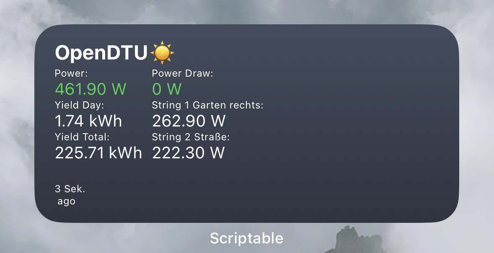

# OpenDTU widget

This is a simple widget for Scriptable that displays current data from your OpenDTU.

_Small widget_

_Medium widget_

## Setup

To set up the widget, follow these steps:

### Obligatory

1. Load the opendtu.js file into Scriptable.
2. Update the `dtuApiUrl` variable with the IP address or URL of your OpenDTU.

### Optional

1. If you want to show the current power draw at your power meter, update the `tasmotaApiUrl` variable with the IP address or URL of your Tasmota device. Don't forget to set `showPowerDraw` to `1`.
2. If you use HTTP basic authentication, make sure to set `dtuUser` and `dtuPass` and/or `tasmotaUser` and `tasmotaPass` respectively.
3. If desired, you may customize the thresholds section as well to configure how the Power value is colored.

## Accessing the widget from the Internet

It is strongly recommended **not** to completely expose your OpenDTU/Tasmota device to the internet due to security reasons. However, if you still want to access it remotely, you can use a reverse proxy such as [Nginx Proxy Manager](https://nginxproxymanager.com/). By configuring the reverse proxy to only expose the `/api/livedata/status` endpoint, you can limit the exposure of your OpenDTU. Same goes for the `/cm?cmnd=status%208` endpoint of your Tasmota device. Since this endpoint only provides read-only access and does not expose any private data, it should be relatively safe. However, please note that I do not take any responsibility for any issues that may arise from this configuration.
For additional security, you might want to set up HTTP Basic authentication for the URLs. The widget provides support for that as well (c.f. above).

For instructions on how to forward the API endpoint using Nginx Proxy Manager, refer to [this](https://github.com/NginxProxyManager/nginx-proxy-manager/issues/104#issuecomment-490720849) hint.

## Links

- [Scriptable](https://scriptable.app/)
- [OpenDTU](https://github.com/tbnobody/OpenDTU)
- [Tasmota](https://tasmota.github.io/docs/)
- [Hichi Reader](https://www.ebay.de/itm/314152997777) to read the values from my power meter
- [Nginx Proxy Manager](https://nginxproxymanager.com/)
